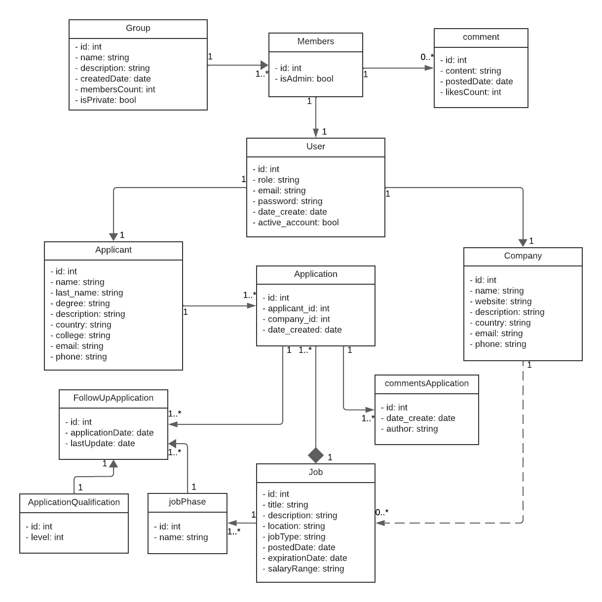
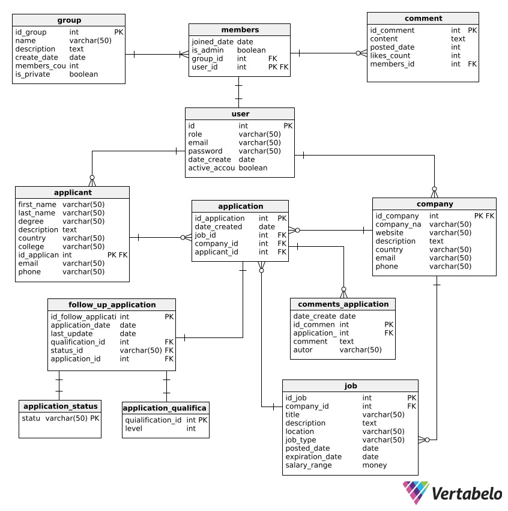

## Introducción

**CareerLink** se presenta como una alternativa para explorar las ofertas en el mercado laboral deseado, mientras se construye un perfil profesional que pueda ser explorado y analizado velozmente por empresas en búsqueda de talento específico. Además de postular a empleos y crear un perfil público, nuestros usuarios también pueden hacer seguimiento de sus postulaciones, recibir ofertas personalizadas, publicar oportunidades laborales y realizar entrevistas con candidatos. La aplicación permite a los administradores realizar operaciones CRUD (Crear, Leer, Actualizar, Eliminar) sobre empleos, clientes y empresas, gestionando de manera eficiente los empleos.

### Colaboradores del Proyecto

| **Nombre**                        | **Rol**                                     | **Perfil**                                                 |
|-----------------------------------|---------------------------------------------|------------------------------------------------------------|
| Mauricio Eduardo Vera Castellon   | Líder del Proyecto | [LinkedIn](https://www.linkedin.com/in/mauricio-c-616227b0/)           |

### Revisa el Progreso del Proyecto BookHub

| **Columna**       | **Descripción**                                                                                                                                    |
|-------------------|----------------------------------------------------------------------------------------------------------------------------------------------------|
| **Backlog**       | Contiene todas las historias de usuario, tareas y características que deben desarrollarse. Es el listado de todo el trabajo pendiente.              |
| **En Progreso**   | Incluye las tareas que están actualmente en desarrollo. Visualiza el trabajo en curso para asegurar el flujo continuo de trabajo.                   |
| **Revisión**      | Después de completar una tarea, se mueve aquí para una revisión de código y revisión por pares (peer review). Esta fase incluye la creación de **pull requests** para asegurar que el código cumpla con los estándares de calidad antes de integrarse al proyecto principal. |
| **En Pruebas**    | Contiene las tareas que han pasado la revisión de código y necesitan pruebas exhaustivas (unitarias, de integración y de aceptación) para garantizar su calidad. |
| **Hecho**         | Las tareas completamente desarrolladas, revisadas y probadas se mueven aquí, indicando que están listas y finalizadas.                               |

Mira cómo va avanzando mi trabajo visitando el siguiente enlace: [Tablero de Projecto](https://github.com/users/mauriciocastellon/projects/1).

### Funcionalidades de la Aplicación CareerLink

#### **Módulo de Gestión de Usuarios**

- **Creación de Usuarios e Inicio de Sesión:**
    - Permitir a los usuarios registrarse en la plataforma.
    - Facilitar el inicio de sesión para acceder a la cuenta personal.
    - Mantener la seguridad de las credenciales de los usuarios.

#### **Módulo de Gestión de Empleos**

- **Gestión de Empleos:**
    - Añadir nuevos empleos.
    - Editar detalles de los empleos existentes.
    - Eliminar empleos.
    - Listar todos los empleos disponibles para los usuarios.

- **Categorías de Empleos:**
    - Clasificar empleos en diferentes categorías.
    - Facilitar la navegación y búsqueda de empleos por categoría.
    - Mejorar la organización del catálogo de empleos.

- **Gestión de Empleadores:**
    - Añadir nuevos empleadores a la base de datos.
    - Editar información de empleadores existentes.
    - Eliminar empleadores de la base de datos.
    - Mantener actualizada la información de los empleadores.

#### **Módulo de Coleccion Personal**

- **Biblioteca Personal de Empleos:**
    - Permitir a los usuarios organizar sus empleos en colecciones personalizadas.
    - Facilitar la creación, edición y eliminación de colecciones de empleos.
    - Mejorar el acceso y la gestión de la coleccion personal del usuario.

#### **Módulo de Reportes** (maybe)

- **Reportes de Actividad:**
    - Generar reportes de aplicaciones realizadas por los usuarios.
    - Mostrar estadísticas de aplicaciones de empleos.
    - Proveer información detallada sobre la actividad de los usuarios, como cantidad de aplicaciones o empleadores mas populares.

## Diagramas de la Aplicación

Para entender mejor la estructura y diseño de la aplicación "Careerlink", revisa los siguientes diagramas:

### Diagrama de Clases

### Diagrama de Base de Datos

Este diagrama ilustra el esquema de la base de datos utilizada por la aplicación, mostrando las tablas, columnas, y relaciones entre las entidades.

### Descripción de Capas del Proyecto

| capa        | descripción                                                                                  |
|-------------|----------------------------------------------------------------------------------------------|
| api         | Contiene los controladores REST que manejan las solicitudes HTTP y las respuestas.            |
| entity      | Define las entidades del modelo de datos que se mapean a las tablas de la base de datos.      |
| repository  | Proporciona la interfaz para las operaciones CRUD y la interacción con la base de datos.      |
| service     | Declara la lógica de negocio y las operaciones que se realizarán sobre las entidades.         |
| service impl| Implementa la lógica de negocio definida en los servicios, utilizando los repositorios necesarios. |

# Asignación de Historias de Usuario

**Sprint 1:** Funcionalidades Básicas  
  *Enfocado en implementar las funcionalidades esenciales de CRUD para la gestión de categorías, libros, autores, usuarios, y el flujo inicial de compras, asegurando que el producto esté listo para un uso básico.*

| Integrante  | Módulo                       | Historia de Usuario                                                   | Descripción                                                                                                                                      | Tipo  |
|-------------|------------------------------|----------------------------------------------------------------------|--------------------------------------------------------------------------------------------------------------------------------------------------|-------|
| Integrante 1| Gestión de Categorías         | Historia de Usuario 1: Crear categorías.                              | Como administrador, quiero poder crear, leer, actualizar y eliminar categorías para mantener organizada la colección de libros.                   | CRUD  |
|             | Gestión de Libros             | Historia de Usuario 2: Crear libros.                                  | Como administrador, quiero poder crear, leer, actualizar y eliminar libros para mantener actualizada la oferta disponible en la plataforma.       | CRUD  |
| Integrante 2| Gestión de Autores            | Historia de Usuario 3: Crear autores.                                 | Como administrador, quiero poder crear, leer, actualizar y eliminar información de autores para mantener actualizada la base de datos de autores de libros. | CRUD  |
|             | Gestión de Reportes           | Historia de Usuario 4: Generar reportes básicos de libros por categoría. | Como administrador, quiero generar reportes de libros filtrados por categoría para obtener información sobre el catálogo disponible.              | CRUD  |
| Integrante 3| Gestión de Usuarios           | Historia de Usuario 5: Registrar usuarios.                            | Como usuario, quiero poder registrarme en la plataforma para acceder a las funcionalidades disponibles.                                           | CRUD  |
|             | Gestión de Usuarios           | Historia de Usuario 6: Permitir a los usuarios actualizar su información personal. | Como usuario, quiero poder actualizar mi información personal para mantener mis datos al día en la plataforma.                                    | CRUD  |
|             | Gestión de Usuarios           | Historia de Usuario 9: Ver Detalles de mi Perfil.                     | Como usuario, quiero poder ver todos los detalles de mi perfil en una sección dedicada para revisar mi información personal y mi historial de actividad en la plataforma. | CRUD  |
| Integrante 4| Gestión de Compras            | Historia de Usuario 10: Configurar flujo inicial de compra de libros (sin integración de pago). | Como usuario, quiero poder seleccionar libros para comprarlos, simulando el flujo de compra inicial antes de integrar los métodos de pago.       | Core  |
|             | Gestión de Reportes           | Historia de Usuario 11: Generar reporte de historial de compras.       | Como usuario, quiero generar un reporte de mi historial de compras para revisar las transacciones realizadas en la plataforma.                    | Core  |
| Integrante 5| Gestión de Colección de Libros | Historia de Usuario 12: Añadir libros a la colección del usuario.      | Como usuario, quiero poder añadir libros a mi colección personal para organizar mis lecturas y favoritos en un solo lugar.                        | Core  |
|             | Gestión de Colección de Libros | Historia de Usuario 13: Eliminar libros de la colección del usuario.   | Como usuario, quiero poder eliminar libros de mi colección personal cuando ya no los necesite o no desee tenerlos en mi lista.                    | Core  |
|             | Gestión de Colección de Libros | Historia de Usuario 14: Ver la lista de libros en la colección del usuario. | Como usuario, quiero ver la lista completa de libros en mi colección para gestionar y revisar fácilmente mis libros favoritos.                    | CRUD  |

 **Sprint 2:** Integración de Funcionalidades y Optimización del Producto  
  *Orientado a la implementación de funcionalidades adicionales, como filtros, reportes detallados, integración de métodos de pago, autenticación y autorización de usuarios, optimización del sistema, y exportación de datos, para garantizar un producto final completo y funcional.*

| Integrante  | Módulo                       | Historia de Usuario                                                   | Descripción                                                                                                                                      | Tipo  |
|-------------|------------------------------|----------------------------------------------------------------------|--------------------------------------------------------------------------------------------------------------------------------------------------|-------|
| Integrante 1| Gestión de Categorías         | Historia de Usuario 21: Filtrar categorías por criterios específicos. | Como administrador, quiero poder filtrar categorías por criterios específicos para gestionar mejor la organización del catálogo de libros.        | CRUD  |
|             | Gestión de Libros             | Historia de Usuario 22: Implementar paginación en la lista de libros. | Como administrador, quiero poder ver la lista de libros con paginación para facilitar la gestión de grandes volúmenes de datos en la plataforma.  | Core  |
|             | Gestión de Reportes           | Historia de Usuario 23: Exportar reportes de libros por categoría en PDF y Excel. | Como administrador, quiero exportar reportes de libros por categoría en formatos PDF y Excel para facilitar la presentación y análisis de datos. | Core  |
| Integrante 2| Gestión de Autores            | Historia de Usuario 24: Buscar y filtrar autores por nombre o nacionalidad. | Como administrador, quiero poder buscar y filtrar autores por nombre o nacionalidad para mejorar la gestión y actualización de la base de datos de autores. | CRUD  |
|             | Gestión de Reportes           | Historia de Usuario 25: Generar reportes avanzados de libros por autor. | Como administrador, quiero generar reportes avanzados que muestren los libros agrupados por autor para analizar el inventario de la biblioteca.   | Core  |
|             | Gestión de Compras            | Historia de Usuario 26: Integrar métodos de pago adicionales.          | Como usuario, quiero contar con diferentes métodos de pago para poder elegir la opción más conveniente al realizar una compra.                    | Core  |
| Integrante 3| Gestión de Usuarios           | Historia de Usuario 27: Implementar autenticación y autorización con roles. | Como administrador, quiero poder gestionar los accesos de los usuarios mediante roles y permisos para asegurar la seguridad y privacidad de la información. | Core  |
|             | Gestión de Usuarios           | Historia de Usuario 28: Inicio de sesión con Google.                  | Como usuario, quiero iniciar sesión en la plataforma utilizando mi cuenta de Google para mayor comodidad y seguridad.                              | Core  |
|             | Gestión de Reportes           | Historia de Usuario 29: Generar reporte de historial de compras del usuario en PDF. | Como usuario, quiero generar un reporte en formato PDF que detalle todas mis compras realizadas en la plataforma, para tener un registro claro de mis transacciones. | Core  |
| Integrante 4| Gestión de Compras            | Historia de Usuario 30: Integrar funcionalidad completa de pagos con PayPal. | Como usuario, quiero poder completar mi compra de libros utilizando PayPal, asegurando una transacción segura y fluida.                           | Core  |
|             | Gestión de Compras            | Historia de Usuario 31: Generar reportes de ventas detallados con filtros avanzados. | Como administrador, quiero generar reportes de ventas detallados que incluyan filtros avanzados para analizar mejor las transacciones y el comportamiento del cliente. | Core  |
|             | Gestión de Reportes           | Historia de Usuario 32: Generar reporte de ventas totales por periodo en PDF. | Como administrador, quiero generar un reporte en formato PDF que muestre las ventas totales por un periodo determinado para evaluar el rendimiento de la tienda. | Core  |
| Integrante 5| Gestión de Colección de Libros | Historia de Usuario 33: Implementar filtros avanzados en la colección de libros del usuario. | Como usuario, quiero poder filtrar mi colección de libros utilizando múltiples criterios como género, autor, y fecha de adición para una mejor organización. | Core  |
|             | Gestión de Colección de Libros | Historia de Usuario 34: Exportar la colección de libros a diferentes formatos. | Como usuario, quiero poder exportar mi colección de libros en formatos como CSV y PDF para tener una copia personal de mis libros organizados.     | Core  |
|             | Gestión de Colección de Libros | Historia de Usuario 35: Compartir la colección de libros con otros usuarios. | Como usuario, quiero poder compartir mi colección de libros con otros usuarios para recomendar libros y discutir lecturas.                        | Core  |
